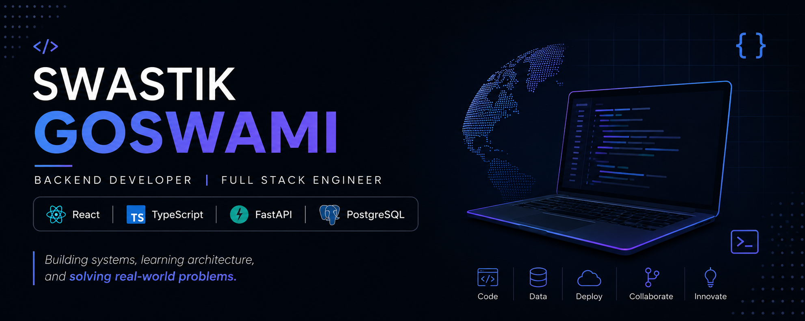

  

# Hi there 👋, I'm Swastik

### Software Engineering Student • Backend & Full-Stack Developer

Building systems, learning distributed applications, and turning ideas into products.

---

## 🚀 Current Focus

* Building **BuildMonitor** (flagship project)
* Learning **Docker**, **CI/CD**, and backend architecture
* Working through the **100x Backend Cohort**
* Solving **100+ DSA problems**
* Improving system design and development workflows

---

## 🛠 Tech Stack

### Languages

### Frontend

### Backend

### Database

### DevOps

---

## 📌 Featured Projects

### 🔹 BuildMonitor *(In Progress)*

Developer-focused monitoring platform for build tracking, deployment visibility, and engineering workflows.

### 🔹 CICD-Healing-Agent

Automated CI/CD issue detection and recovery workflows.

### 🔹 PolyLingo

Language translation platform built with TypeScript.

### 🔹 FAQ Chatbot

Intelligent FAQ assistant using NLP and conversational interfaces.

---

## 📊 GitHub Stats

---

## 🎯 2026 Goals

* Complete BuildMonitor
* Master React + TypeScript
* Learn Docker & CI/CD thoroughly
* Solve 100+ DSA problems
* Land a Software Engineering Internship

---

## 📫 Connect With Me

* GitHub: https://github.com/Swastik725
* LinkedIn: *(add your LinkedIn here once optimized)*

---

> "Consistency beats intensity."
